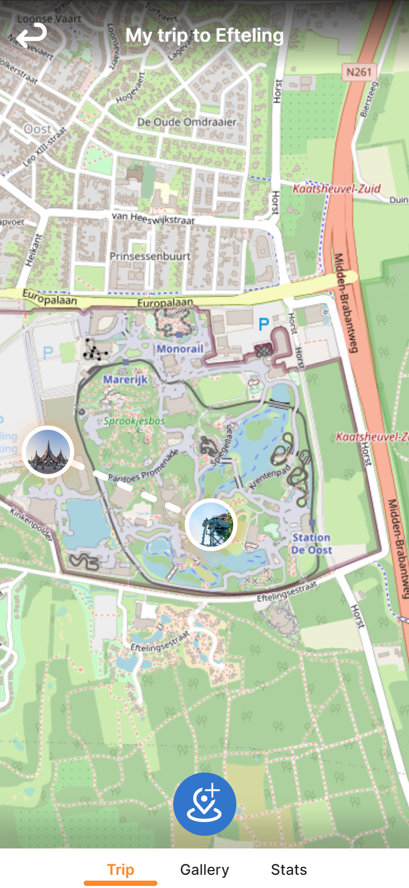
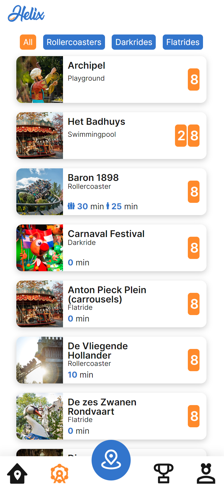

# Git repository Helix app

## Introduction

For a schoolproject we invented Helix, the mobile app for the themepark enthousiast. In the app users can share their trips to themeparks, view trips from other users, accomplish challenges and achievements to get cool in app rewards and view their coastercount and other cool statistics. In this Git repo we workout how some of the functions from our app will work, so called Proof Of Concepts (POC).

## The app

If you want to test te parts of the app that we made, you can follow [this](http://helix.kevinvloon.nl) link. The pages that you can try are the "trip" and "count" page wich you also can see down here. The app is made for your mobile. So if you are checking it out on your laptop, we advice to check it in inspect mode (F12) and use smartphone dimension.

 

### Demo's
- [Attractions and waitingtimes](https://youtu.be/Xygd-tDjZ_A)
- [Manage trip](https://youtube.com/shorts/yk2bYdstIP8)

## Software

The app in this repo is built with **ReactJS**. We've chosen to use React for this POC because we already have experience with React so we don't have to learn a new framework in the short amount of time that's  and React uses, among other things, virtual DOM (Document Object Model), this makes it easy to adjust the content, layout and structure of an HTML document because with virtual DOM you can easily apply updates without virtually rewriting the entire HTML document has to be made, making the render updates much faster and resulting in faster performance compared to Angular which uses real DOM. In addition, React uses one-way data binding, which means that any change in component data is reflected in the view and vice versa. This will make the code more stable and easier to debug.

### Tools

- ReactJS 18.2.0
    - React-router-dom
    - Sass
    - ClassNames
    - Leaflet
    - React-leaflet
    - React-webcam
    - Axios
    - React-draggable
- SCSS
- JSON

### Available React Scripts

In the project directory, you can run:

#### `npm i`

When you just've cloned the repository you first need to run this script so all the packages are being installed. Without running this script the app won't run in development mode.

#### `npm start`

Runs the app in the development mode.\
Open [http://localhost:3000](http://localhost:3000) to view it in your browser.

The page will reload when you make changes.\
You may also see any lint errors in the console.

#### `npm test`

Launches the test runner in the interactive watch mode.\
See the section about [running tests](https://facebook.github.io/create-react-app/docs/running-tests) for more information.

#### `npm run build`

Builds the app for production to the `build` folder.\
It correctly bundles React in production mode and optimizes the build for the best performance.

The build is minified and the filenames include the hashes.\
Your app is ready to be deployed!

See the section about [deployment](https://facebook.github.io/create-react-app/docs/deployment) for more information.

#### `npm run eject`

**Note: this is a one-way operation. Once you `eject`, you can't go back!**

If you aren't satisfied with the build tool and configuration choices, you can `eject` at any time. This command will remove the single build dependency from your project.

Instead, it will copy all the configuration files and the transitive dependencies (webpack, Babel, ESLint, etc) right into your project so you have full control over them. All of the commands except `eject` will still work, but they will point to the copied scripts so you can tweak them. At this point you're on your own.

You don't have to ever use `eject`. The curated feature set is suitable for small and middle deployments, and you shouldn't feel obligated to use this feature. However we understand that this tool wouldn't be useful if you couldn't customize it when you are ready for it.